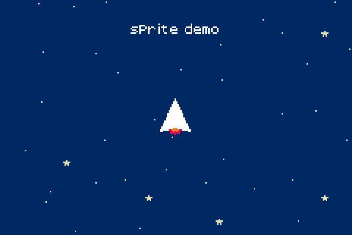

# GBA E-Reader Toolchain and Project Enviornment

The E-Reader was a playing card based hardware accessory the the Nintendo
Game Boy Advance that reads optically encoded software.

The reason this hardware is of particular interest is the ability to "publish"
your own software by simply printing the dot code strips and giving them to
other's with the hardware. There is no need for any custom hardware to run
new software.

## Example Project

If you want to jump straight into it, an [Example Project](https://github.com/AkBKukU/e-reader-dev/tree/main/projects#example-project)
has been included. Be sure to set up the `bin/` directory [as needed](https://github.com/AkBKukU/e-reader-dev/blob/main/bin/README.MD)
and setup the [GBA Development](https://github.com/AkBKukU/e-reader-dev?tab=readme-ov-file#gba-developement)
enviornment first.

## Running This Repo

This repo has been setup primarily as a linux first development enviornment.
However, I have been simultaneously been testing it with WSL Ubuntu and have
had no issues (other than the flash save file tool needing `wine` on linux
and being able to run natively on Windows.) It should be entirely possible to
use this setup on either Windows or Linux as a result.

## Understanding The Development Tools

The dev tools usable for the E-Reader can be split into three categories:
 - [GBA Development](https://github.com/AkBKukU/e-reader-dev?tab=readme-ov-file#gba-developement)
 - [E-Reader Conversion Tools](https://github.com/AkBKukU/e-reader-dev?tab=readme-ov-file#e-reader-conversion-tools)
 - [General GBA Dev Tools](https://github.com/AkBKukU/e-reader-dev?tab=readme-ov-file#e-reader-conversion-tools)

The E-Reader has several execution modes, most notably it can run as an NES
or as a GBA. If you stick with the GBA mode you can use the standard open
source GBA developement toolchain. The main difference is linking in some
decicated E-Reader features that are availble. These give you some generic
assets to save executable space and reduce the card count.

## GBA Developement

The recommended toolchain is [DevKitPro](https://devkitpro.org) which supports
targeting multiple devices. But we are intersted in the GBA ARM toolchain for
this.

The easiest way to test your code is with an emulator, [mGBA](https://mgba.io/)
works very well for this. It supports loading save data as well as directly 
loading  Dot Code data stored in BMP image files. mGBA even supports debugging
with a [gdb server](https://felixjones.co.uk/mgba_gdb/vscode.html).

### Toolchain Installation

DevKitPro has an annoying and inflexible [setup process](https://devkitpro.org/wiki/devkitPro_pacman#Debian_and_derivatives)
rather than distributting binaries.

The TL;DR to get it usable for E-Reader GBA Dev is the following:

	wget https://apt.devkitpro.org/install-devkitpro-pacman
	chmod +x ./install-devkitpro-pacman
	sudo ./install-devkitpro-pacman
	sudo dkp-pacman -S gba-dev

### Usage
Each time you start your terminal enviornment for GBA dev you need to load in
configuration for the DevKitPro toolchain.

	source /etc/profile.d/devkit-env.sh

This sets up environment variables for you to use in your dev processes:

	export DEVKITPRO=/opt/devkitpro
	export DEVKITARM=${DEVKITPRO}/devkitARM
	export PATH=${DEVKITPRO}/tools/bin:$PATH     

The `$DEVKITARM/bin` directory contains the `gcc` tools for compiling C/C++ code
for the GBA. 

## E-Reader Conversion Tools

Once you have a valid GBA binary you need to convert it to work on the E-Reader.
There is a version of the tools available for [multiple platforms](https://github.com/breadbored/nedclib)
Downloading and compiling these tools will give you nearly everything you need
to create usable E-Reader cards.

With the tools, there are a few steps to this process:

 1. `nevpk` - VPK Compression
 2. `nedcmake` - Dot Code binary generation
 3. `nedcenc` - Dot Code Encoding
 4. `raw2bmp` - Dot Code image generation

These steps are best done as part of a build process after compiling with GCC
and make sense to include in a MakeFile. They generally each take the output as
the input to the next step. There is a variance when your program becomes large
enough to split across multiple cards (which I am not able to cover yet.)

There is one alternative step 2 you can do when doing development. Using 
[neflashmaker](https://www.caitsith2.com/ereader/tools/neflashmaker10.zip)
will encode the program in a way GBA emulators can load as game save data. The 
E-Reader can store software on it, and this can "inject" your program into it.

## General GBA Dev Tools

Other Dev tools for the GBA can be helpful for importing assets like graphics 
and sound. Because the GBA is a monolithic ROM based system, assets are embedded
in the main executable. This is usually done as arrays of bytes holding the raw
data.

### Graphics

A few programs for working with graphics that convert them into compatible 
formats or directly into C array files.

 - [gfx2gba](https://www.gbadev.org/tools.php?showinfo=142) & [b2x](http://www.devrs.com/gb/files/b2x.zip) - GBA graphics conversion and c array encoder
 - [png2raw](https://github.com/IanFinlayson/png2gba) - Direct PNG to C array encoder

### Sound

Sound is 8 bit signed PCM and does not have a fixed sample rate. You don't need
any special software to encode these, export them with Audacity or use `ffmpeg`
to convert to the `s8` codec. To get those into C arrays you still need other
tools though:

 - [raw2png](https://github.com/IanFinlayson/raw2gba) - Converts PCM to C arrays

I recommend [this](https://ianfinlayson.net/class/cpsc305/notes/19-sound) 
article for more information and examples on using sound.

